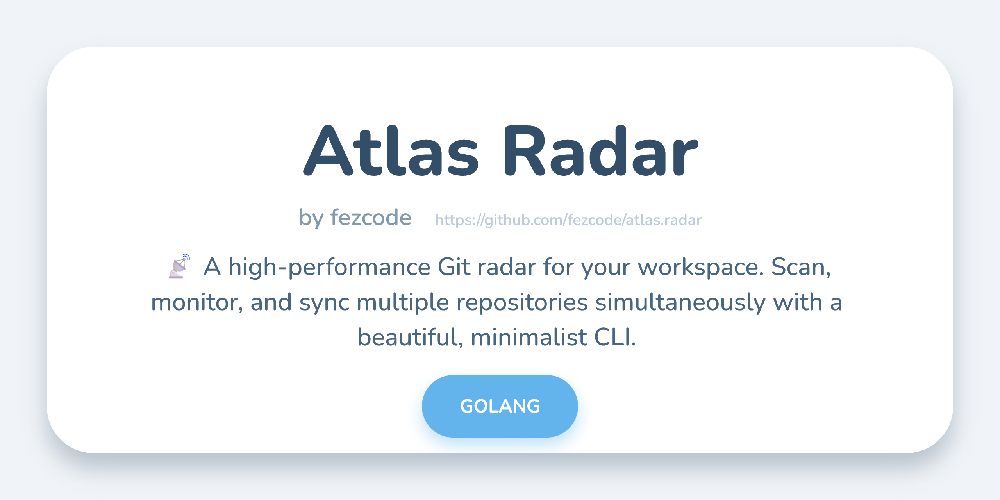

# Atlas Radar



> [!IMPORTANT]
> **atlas.radar** is part of the **Atlas Suite**—a collection of high-visibility, local-first terminal utilities designed for power users who demand precision and aesthetic clarity.

**atlas.radar** is a high-performance Git workspace monitor that provides a bird's-eye view of all repositories within a directory. It instantly identifies dirty working trees, ahead/behind counts, and current branches, allowing you to manage large project folders with zero cognitive overhead.


## ✨ Key Features

- 📡 **Deep Scanning:** Recursively identifies every Git repository in a workspace.
- 🔄 **Real-time Monitoring:** Use `--watch` to keep an eye on your projects as you code.
- 📊 **Table View:** Clean, structured tabular output for comprehensive auditing.
- 🚀 **Bulk Operations:** Fetch, Pull, or Push across multiple repositories simultaneously.
- 🔍 **Filtering:** Filter by repository name (regex) or remote count.
- 🎨 **High-Visibility UI:** Uses the Atlas "Onyx & Gold" aesthetic for maximum readability.

## 🚀 Installation

### Using Gobake (Recommended)
```bash
git clone https://github.com/fezcode/atlas.radar
cd atlas.radar
gobake build
```

## ⌨️ Usage

### Basic Scan
Scan the current directory for Git repositories:
```bash
atlas.radar
```

### Table View
Show structured results in a table:
```bash
atlas.radar --table
```

### Filtering by Remotes
Show only repositories that have no remotes (local-only):
```bash
atlas.radar --remote 0
```

### Bulk Update
Fetch updates for all repositories matching a pattern:
```bash
atlas.radar --fetch --pattern atlas
```

### Options & Flags

| Flag | Description | Default |
|------|-------------|---------|
| `--show` | Filter repos (`all`, `clean`, `unclean`) | `all` |
| `--watch` | Continuously monitor status | `false` |
| `--table` | Display results in a table | `false` |
| `--fetch` | Fetch updates for all matched repos | `false` |
| `--pull` | Pull updates for all matched repos | `false` |
| `--push` | Push updates for all matched repos | `false` |
| `--pattern`| Regex pattern to match repo names | `""` |
| `--remote` | Filter by number of remotes | `-1` |

## 🏗️ Architecture & Philosophy

- **Local-First:** Operates entirely on your local filesystem using native Git commands.
- **Speed:** Optimized scanning that skips non-repository directories instantly.
- **Design:** Built with `lipgloss` for a professional, high-fidelity terminal experience.

## 📄 License
MIT License - Copyright (c) 2026 FezCode.
